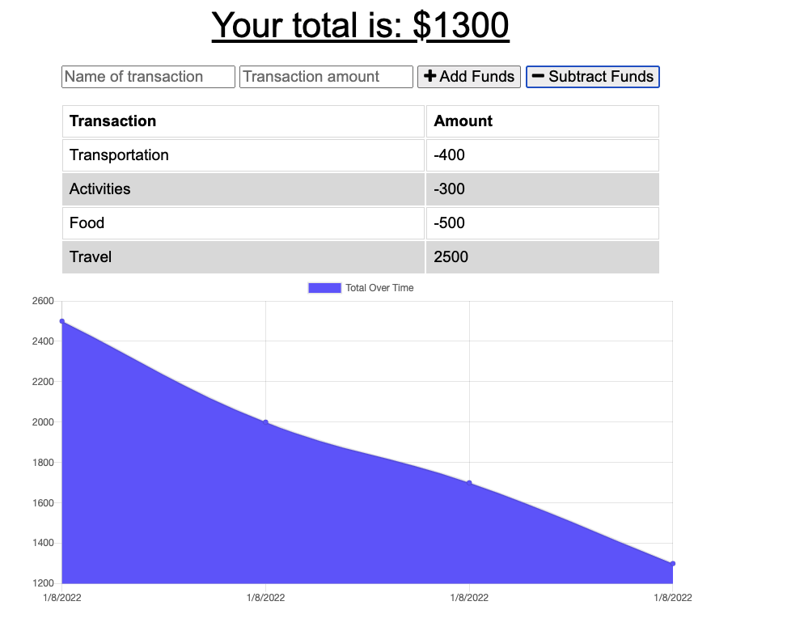

# finance-trend

Heroku lINK: https://finances-trends.herokuapp.com/

## User Story

This app will be able to track all the withdrawals and deposits with or without a data/internet connection so that the customer's account balance is accurate when he is traveling .

## Acceptance Critera

GIVEN a budget tracker without an internet connection
* WHEN the user inputs an expense or deposit
THEN they will receive a notification that they have added an expense or deposit
* WHEN the user reestablishes an internet connection
THEN the deposits or expenses added while they were offline are added to their transaction history and their totals are updated

# Installation needed:

* compression
* express
* mongoose
* morgan

# Screenshot:

## Personal info

Use npm run start to activate the app, or simply use the deployed link above. It gives you an Up to date way to track your expenses and stay on Budget.